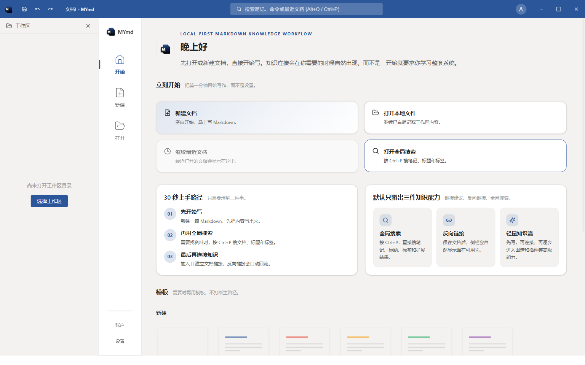
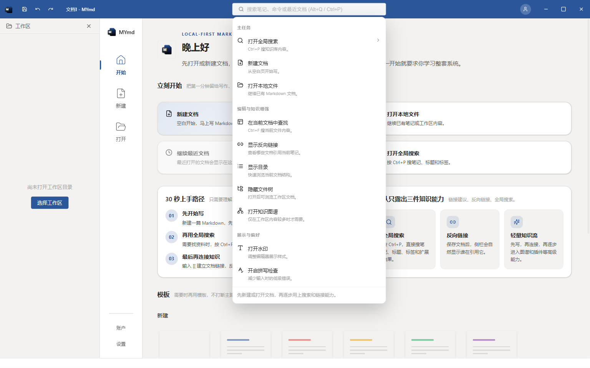
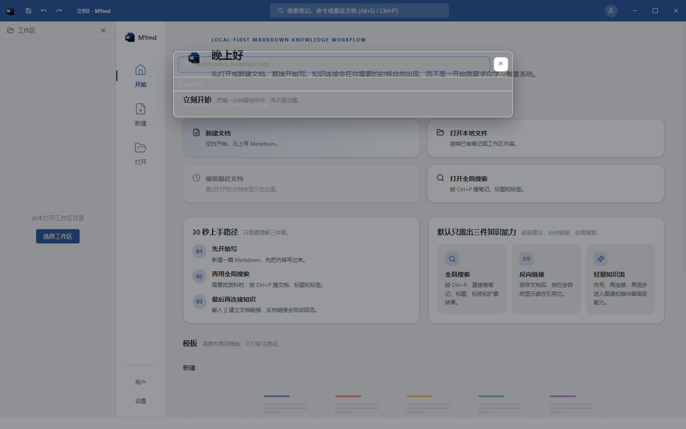
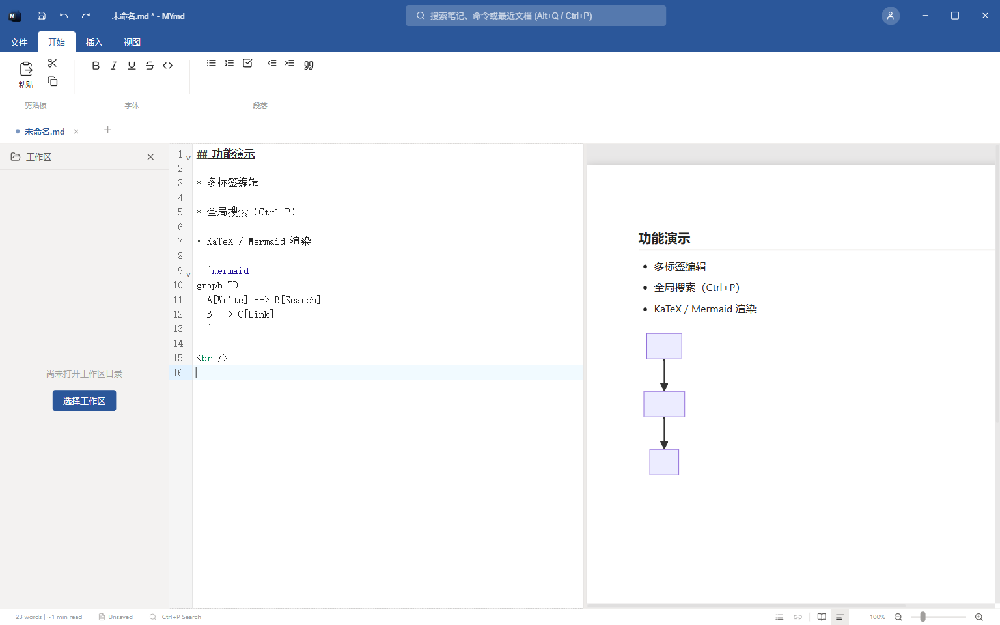

<div align="center">
  
  <h1>MYmd</h1>
  <p>Local-first Markdown desktop editor built with Tauri</p>

  <p>
    <a href="https://github.com/LaplaceYoung/MYmd/releases"></a>
    <a href="https://github.com/LaplaceYoung/MYmd/stargazers"></a>
    <a href="https://github.com/LaplaceYoung/MYmd/blob/main/LICENSE"></a>
  </p>
</div>

<br/>

[Read in English](README_en.md) | [阅读中文](README.md)

MYmd is a **Tauri + React + TypeScript** local-first Markdown desktop editor with WYSIWYG, source, and split views, designed for high-frequency writing and structured content workflows.

## Version

- Current version: `v1.4.2`
- Target platform: `Windows x64`
- Latest releases: <https://github.com/LaplaceYoung/MYmd/releases>
- Landing page: <https://laplaceyoung.github.io/MYmd/>

## Screenshots

### Welcome Overview



### Top Search Dropdown (Transparency Fix Applied)



### Global Search Modal



### Split Editor with Live Preview (Mermaid Included)



## Feature Overview

### Editing Experience

- Multi-tab editing for fast context switching.
- Three editing views: WYSIWYG, Source, and Split.
- Focus Mode and Typewriter Mode for distraction-reduced writing.
- Unsaved-change detection with close confirmation.

### File Workflow

- New, open, save, save-as, and HTML export.
- Global auto-save (only for files already persisted to disk).
- Workspace file explorer for navigation and open actions.
- File association support for `.md` and `.markdown`.

### Content Capabilities

- Built-in KaTeX math rendering.
- Built-in Mermaid diagram rendering.
- Syntax highlighting powered by Prism/Refractor.
- TOC sidebar and global search/replace.

### Desktop Integration

- Native Tauri window runtime with custom title bar controls.
- Single-instance behavior: file args from second launches are forwarded to the running window.
- Startup open-file flow avoids welcome-page flicker before CLI file loading finishes.

## v1.4.2 Highlights

1. Fixed top search dropdown readability: removed transparent/invalid background token usage that caused blending with page content.
2. Stabilized title-bar search palette by replacing undefined tokens (`--bg-secondary`, `--text-main`) with theme-safe variables.
3. Completed release validation cycle: `npm run typecheck`, `npm run build`, and `npm run tauri build`.
4. Produced new Windows installer package and synced distribution artifact in `release/`.

## Tech Stack

| Layer | Technology |
| --- | --- |
| UI | React 19, TypeScript, Tailwind CSS |
| Editor | Milkdown, ProseMirror, CodeMirror 6 |
| State | Zustand |
| Desktop Runtime | Tauri v2 |
| Native Side | Rust |
| Build | Vite, Tauri CLI |

## Quick Start

### Requirements

- Node.js 20+
- Rust 1.77.2+
- Windows 10/11 (NSIS packaging)

### Local Development

```bash
git clone https://github.com/LaplaceYoung/MYmd.git
cd MYmd
npm install
npm run dev
```

### Desktop Build

```bash
npm run build
npm run tauri build
```

### Release Automation

- Pushing a `v*` tag triggers GitHub Actions to build and upload installers to GitHub Releases.
- Workflow file: `.github/workflows/release-tag.yml`

## Installer Artifacts

After a Tauri build on this machine, artifacts are generated in:

- `E:\EnvConfig\rust_target\release\bundle\nsis\MYmd_1.4.2_x64-setup.exe`
- `E:\EnvConfig\rust_target\release\bundle\msi\MYmd_1.4.2_x64_en-US.msi`

Project distribution folder (tracked):

- `release/MYmd_1.4.2_x64-setup.exe`

## Project Structure

```text
MYmd/
|- src/                 # React frontend
|- src-tauri/           # Tauri + Rust backend
|- docs/                # Product and project docs
|- templates/           # Built-in template examples
|- release/             # Release artifacts (latest installer)
|- tests/               # Automation and debug scripts
|- README.md            # Chinese README
`- README_en.md         # English README
```

## License

MIT License
