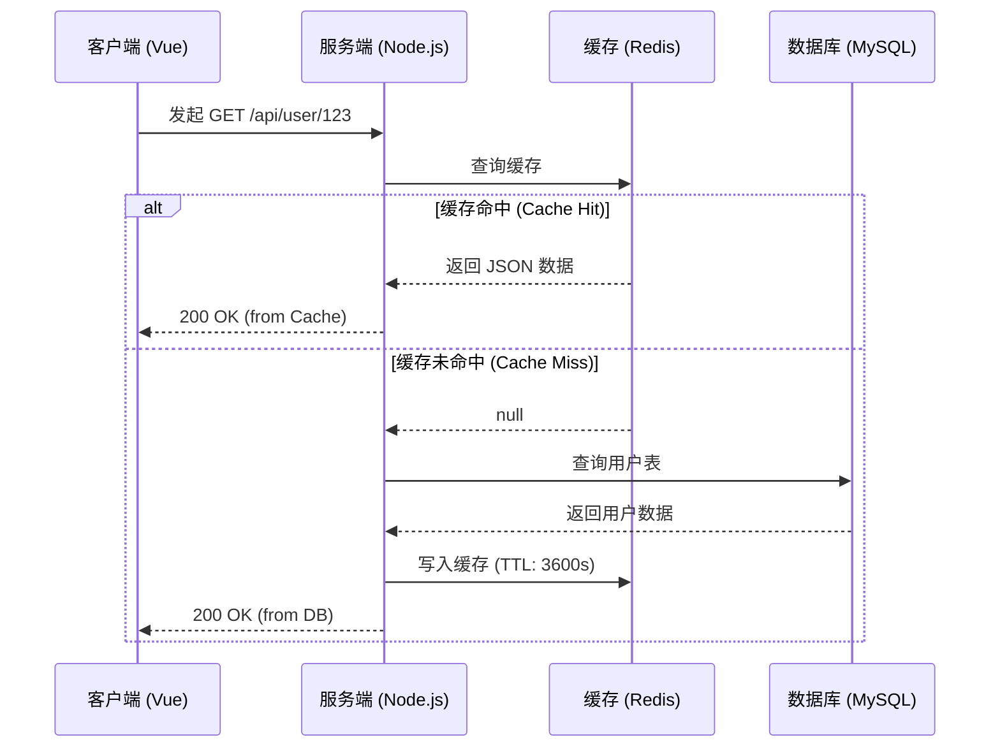

🛠️ [项目名称] 核心模块实现思路

> **作者：** [点击输入姓名] | **状态：** 🚧 进行中 | **版本：** v1.0.0

---

## 1. 需求背景

这里简述为什么要开发这个模块，解决了什么痛点？

- **现有问题：** [在此描述当前系统遇到的瓶颈]
- **解决方案：** 引入新的异步处理机制，降低服务器负载。
- **预期收益：** 响应时间减少 **30%**。

## 2. 核心架构设计 (Architecture)

以下是用户请求处理的流程图，展示了从客户端到数据库的交互逻辑。



## 3. 关键代码片段 (Code Snippets)

我们在后端使用了 Express 框架来处理 API 请求，并在中间件中增加了鉴权逻辑。

### 3.1 路由层 (Controller)

```javascript
const express = require('express');
const router = express.Router();
const User = require('../models/User');

// GET /api/user/:id
router.get('/:id', async (req, res) => {
    try {
        const user = await User.findById(req.params.id);
        if (!user) {
            return res.status(404).json({ message: "用户不存在" });
        }
        res.json(user);
    } catch (err) {
        res.status(500).json({ message: err.message });
    }
});

module.exports = router;
```

### 3.2 数据库模型 (Mongoose Schema)

```typescript
interface IUser {
    name: string;
    email: string;
    role: 'admin' | 'user';
}

const UserSchema = new Schema<IUser>({
    name: { type: String, required: true },
    email: { type: String, required: true, unique: true },
    role: { type: String, enum: ['admin', 'user'], default: 'user' }
});
```

## 4. 待办事项 (To-Do List)

- [x] 完成数据库表结构设计
- [x] 编写基础 API 路由
- [ ] 接入 Redis 缓存 Token
- [ ] 编写单元测试用例 (Jest)
- [ ] 部署至测试环境

---

> **注意：** 修改任何数据库结构前，请务必先备份生产数据！
```

---
